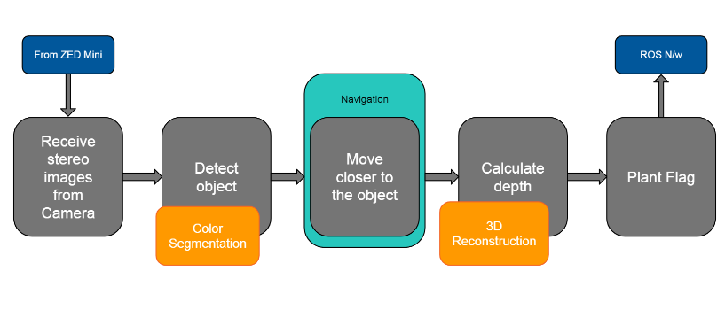

# Course Project - Robotic Vision
Developing a pipeline in MATLAB to detect cans from a sterocamera (ZED Mini) stream and locate the objects in the room. A parallel group tasked with a robotic gripper revieves this coordinates and uses it to drive the gripper robot to the object and grasp it.

